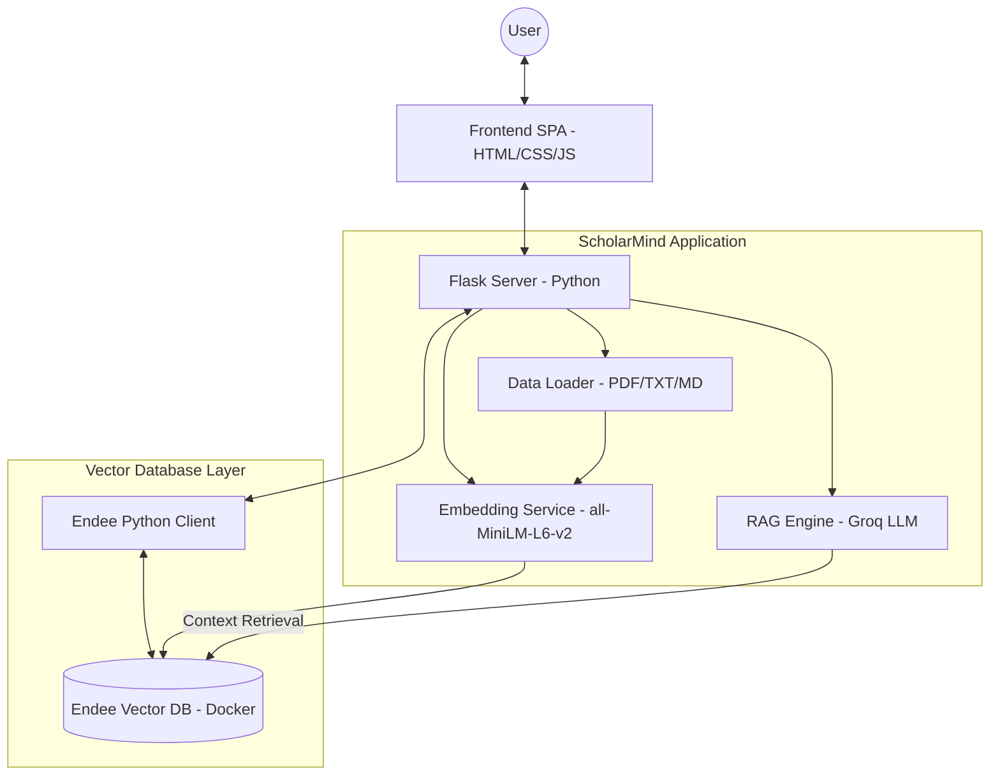

# 🧠 ScholarMind — AI-powered Knowledge Search & RAG Engine

> **Project Submission for Endee Evaluation**
> This repository contains **ScholarMind**, a full-stack AI application built on top of the **Endee Vector Database**. It demonstrates practical use cases including Semantic Search, RAG (Retrieval-Augmented Generation), and filtered vector retrieval.

---

## 📌 Project Overview

**ScholarMind** transforms static documents into an interactive, AI-powered knowledge base. Users can upload PDFs, TXT, or Markdown files, which are then processed, embedded, and stored in **Endee**.

### Key Features:
- **🔍 Semantic Search**: Find relevant document passages by meaning rather than just keywords.
- **💬 RAG Question-Answering**: Ask natural language questions and receive AI-generated answers grounded in your uploaded documents (powered by Groq/Llama3).
- **🏷️ Metadata Filtering**: Narrow down search results by document category using Endee's high-performance payload filtering.
- **🚀 Premium UI**: A sleek, dark-mode dashboard for document management and AI interaction.

---

## 🏗️ System Design

ScholarMind follows a decoupled architecture where the Python/Flask application acts as the orchestration layer and the Endee C++ engine handles the heavy-lifting of vector similarity search.



---

## 🔧 How Endee is Empowering ScholarMind

This project utilizes several core capabilities of the Endee Vector Database:

1.  **HNSW Indexing**: High-speed approximate nearest neighbor search for embeddings.
2.  **Dense Vector Storage**: Efficiently storing 384-dimensional vectors from the `all-MiniLM-L6-v2` model.
3.  **Payload Filtering**: Using Endee's metadata storage to filter search results by `category` (e.g., "AI", "Vector DB").
4.  **Low-Latency Retrieval**: Powering the RAG pipeline with fast context lookup to minimize LLM response times.

---

## 🚀 Setup & Installation

Follow these steps to get the full project running locally on Windows.

### Prerequisites
- **Docker Desktop** (Required for Endee)
- **Python 3.9+**
- **Groq API Key** (Optional for RAG — [Get one for free here](https://console.groq.com))

### Step 1: Start Endee Vector Database
```powershell
# From the root of this repository
docker compose up -d
```
*The database will be available at http://localhost:8080.*

### Step 2: Setup ScholarMind Application
```powershell
cd scholarmind

# Create and activate virtual environment
python -m venv venv
.\venv\Scripts\activate

# Install dependencies
pip install -r requirements.txt
```

### Step 3: Configure Environment
Copy `.env.example` to `.env` and add your Groq API key (if you have one).
```powershell
cp .env.example .env
```

### Step 4: Run ScholarMind
```powershell
python app.py
```
*Visit the application at **http://localhost:5000**.*

---

## 🛠️ Technology Stack
- **Vector DB**: [Endee](https://github.com/endee-io/endee)
- **Backend**: Flask (Python)
- **Embeddings**: Sentence-Transformers (all-MiniLM-L6-v2)
- **LLM**: Groq (Llama-3-8b)
- **Frontend**: Vanilla JavaScript + CSS (Glassmorphism design)

---

# About Endee (Core Database)

Endee is a high-performance open-source vector database built for AI search and retrieval workloads. It is optimized for modern CPU targets, including AVX2, AVX512, NEON, and SVE2.

*For more details on the underlying database engine, see the [original core documentation](./docs/getting-started.md).*

---

## License
Endee and ScholarMind are open-source software licensed under the **Apache License 2.0**.
